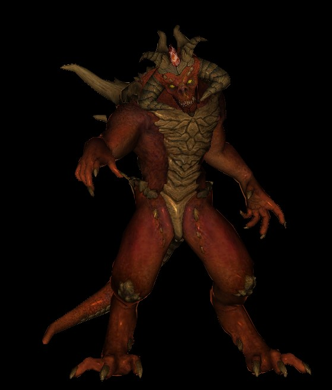
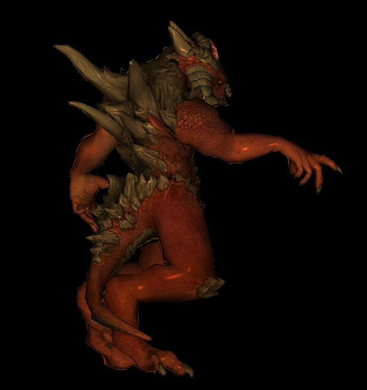
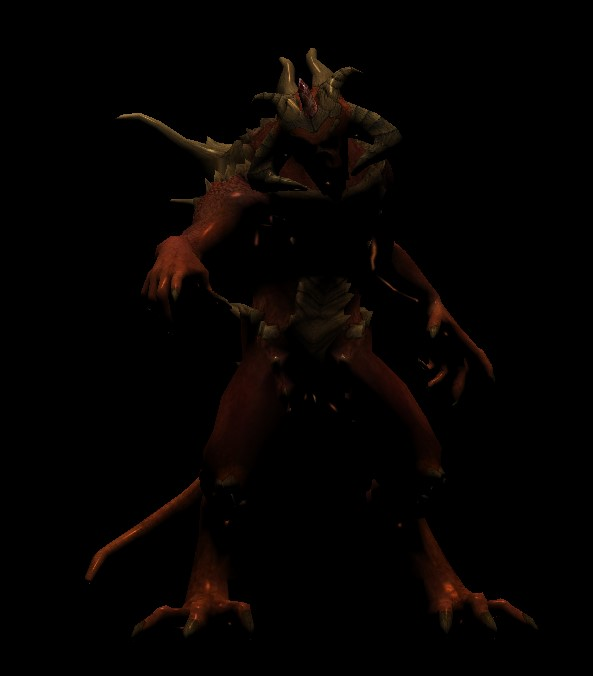
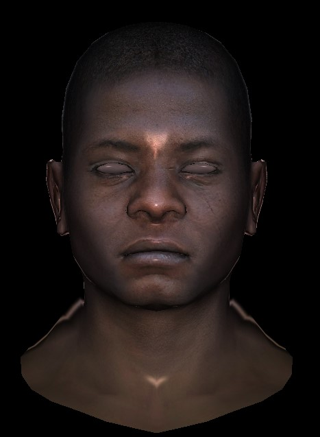
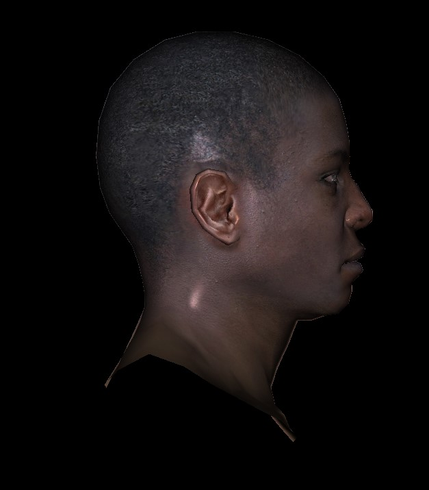
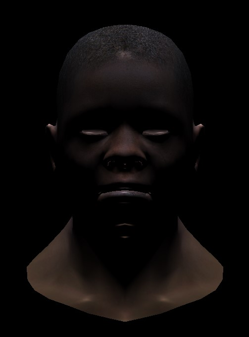

This project was started May 19th 2025.
The goal of this project is to try writing a graphics renderer on the CPU (for now).
This project will be capable of rendering wavefront object files (.obj) files, with more formats to come in the future.

A similar, yet simpler, rendering pipeline to the one present in OpenGL is used for displaying images.
Z-buffering is used to decrease the number of triangles to be drawn to decrease rendering times.
For rendering UV textures, the renderer supports both Phong and Gouraud shading.
Lighting over the model is handled with diffuse and specular reflection for all types of materials.

Currently the renderer uses TGAImage formatting as both input for textures, and output for rendererd models,
however support for formats will be added in the future, specifically .jpeg and .png.

Diablo 3 Render:

Male head Render:

